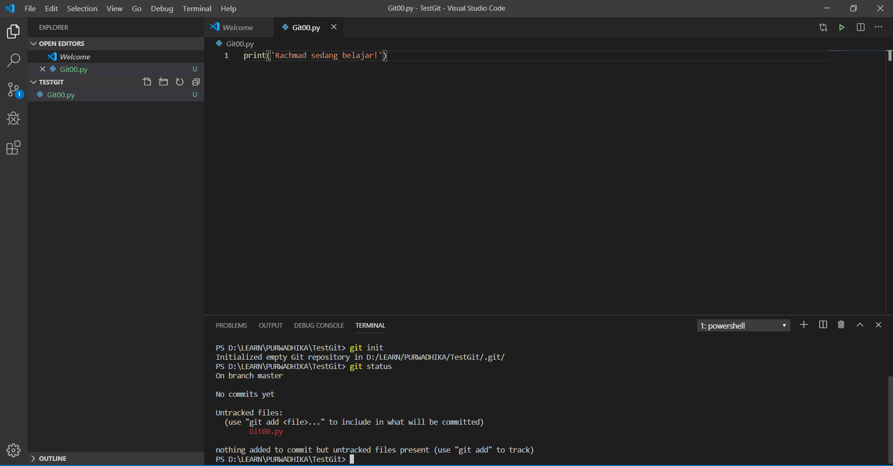
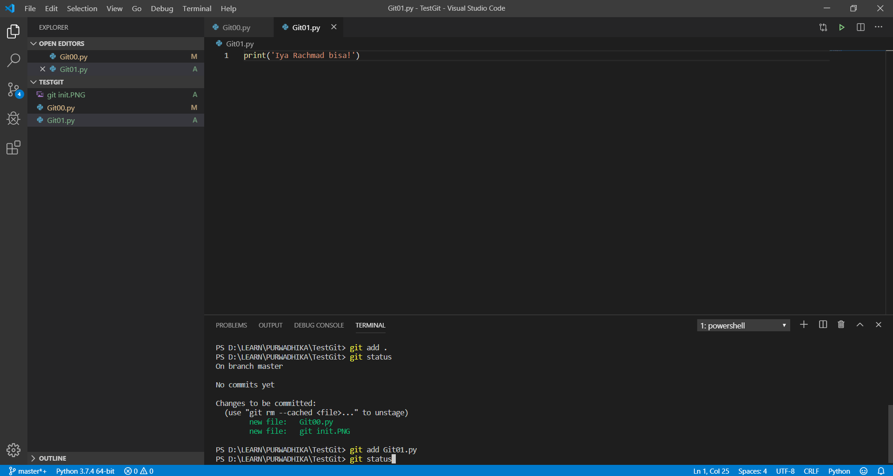
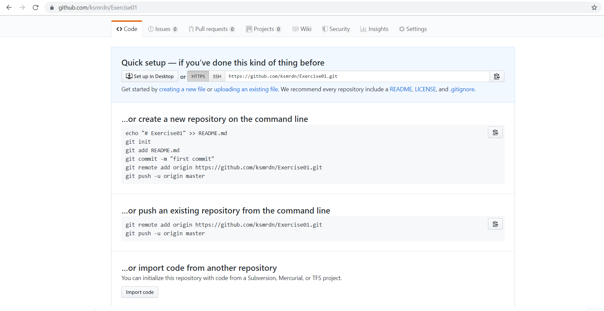

# Bagaimana Cara Membuat Repository GitHub
## 1
#
### 2
#
#### 3
#
__Bold__

**Bold**

_Italic_

__*Bold Italic*__
#
**Git Init**:



**Git Status**:


**Git Push**:


```python
x = 7
if x == 7:
    print('Oke')
else:
    print('No Oke')
```
No. | Nama
-|-
1 | Rachmad
2 | Kusumardana 
